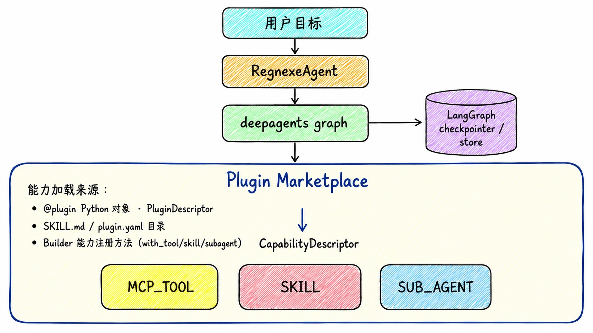

<p align="center">
  <h1 align="center">Regnexe Python</h1>
  <p align="center"><b>基于 deepagents 的应用级 Python Agent 框架</b></p>
  <p align="center">用插件、Skill、子 Agent、记忆、事件和人工审批构建可落地的 Agent 应用。</p>
</p>

<p align="center">
  <a href="https://pypi.org/project/regnexe-py/"></a>
  
  
  
  <a href="LICENSE"></a>
</p>

---

很多 Agent 代码一开始都是直接把 `tools`、`skills`、`subagents` 传给 deepagents。
这对原型很好用。regnexe-py 保留 deepagents 作为底层运行引擎，并在它之上补齐应用框架层：
能力市场、插件装饰器、显式应用/用户/会话身份、跨会话任务记忆、结构化事件、模型厂商路由，以及
用户主动触发的取消能力。



**相比直接使用 deepagents，regnexe-py 的突出优势：**

- **应用结构，而不只是图构建**：把业务工具、Skill、子 Agent、记忆、事件和模型选择统一放进 Builder。
- **插件市场**：能力只需注册一次；更换底层存储（内存、数据库……）不需要改 Agent 代码。
- **业务友好的工具开发**：用 `@plugin` 和 `@agent_tool` 暴露普通 Python 类，不需要重复写 `StructuredTool`。
- **显式身份与记忆**：每次运行都携带 `app_id`、`user_id`、`session_id`，并可把近期任务摘要注入后续会话。
- **用户主动触发的取消**：可以在任意时刻从并发任务中停止正在执行的任务，再从最后完成的步骤继续。
- **执行过程可观测**：事件监听器可接收 LLM 调用、工具调用、工具结果、Token 元数据和 Agent 生命周期事件。

本文档从"一次工具调用"开始，一层一层往深处讲。每个代码块都改编自
[`examples/readme/`](examples/readme) 下一个可直接运行的脚本。

---

## 快速开始

### 1. 安装

```bash
pip install regnexe-py
```

本地开发安装：

```bash
pip install -e ".[dev]"
```

### 2. 配置模型 Key

```bash
export DEEPSEEK_KEY=sk-...
export ALIYUN_KEY=sk-...
export OPENAI_API_KEY=sk-...
```

Ollama 使用本地 Ollama 运行时，不需要 API Key。

### 3. 注册 tool 并运行

`with_tool(...)` 直接注册已经构建好的 LangChain 工具——不需要类，不需要装饰器，是接入 Agent
最快的路径。代码见 [`examples/readme/01_multi_tool.py`](examples/readme/01_multi_tool.py)。

```python
import asyncio
from langchain_core.tools import tool
from regnexe import ConsoleEventListener, RegnexeAgentBuilder, Vendor


@tool
def get_weather(city: str) -> str:
    """Get today's weather for a city."""
    return "北京：晴，22°C。"


@tool
def get_air_quality(city: str) -> str:
    """Get today's air quality index (AQI) for a city."""
    return "北京：AQI 35，空气质量优。"


async def main() -> None:
    agent = (
        RegnexeAgentBuilder()
        .with_default_model(Vendor.DEEPSEEK, "deepseek-v4-flash")
        .with_tool(get_weather, get_air_quality)        # 一次调用，按需注册多个
        .with_event_listener(ConsoleEventListener())
        .build()
    )

    result = await agent.ainvoke(
        "查询北京今天的天气和空气质量，告诉我是否适合户外跑步",
        app_id="demo", user_id="user1", session_id="morning-run",
    )

    print(result.status)        # completed
    print(result.final_text)


asyncio.run(main())
```

`ConsoleEventListener` 会把循环中每一次工具调用和结果都打印出来：

```
[AGENT ▶] RegnexeAgent
          goal: Check today's weather and air quality in Beijing...
[TOOL  ▶] mcp_tool:get_weather  input={"city": "Beijing"}
[TOOL  ■] mcp_tool:get_weather  output=Beijing: sunny, 22 C.
[TOOL  ▶] mcp_tool:get_air_quality  input={"city": "Beijing"}
[TOOL  ■] mcp_tool:get_air_quality  output=Beijing: AQI 35, excellent air quality.
[AGENT ■] status=completed
```

## 为什么不直接用 deepagents

deepagents 是编排引擎。regnexe-py 是围绕这个引擎构建的应用框架。

| 需求 | 直接使用 deepagents | 使用 regnexe-py |
|------|---------------------|-----------------|
| 注册业务工具 | 手动创建并传入 tools | `with_tool(...)`，或在类上用 `@plugin`/`@agent_tool` |
| 混合工具、Skill、子 Agent | 自己维护多个列表 | 通过统一 Builder 和 Marketplace 注册所有能力 |
| 把混合能力打包到同一个 id 下 | 各自单独构造 | 一个 `PluginDescriptor`，装着多个 `CapabilityDescriptor`，共用一个 `plugin_id` |
| 保留用户/会话身份 | 自己设计 thread 命名规则 | 显式使用 `app_id`、`user_id`、`session_id` |
| 复用历史任务结果 | 自己实现存储和 Prompt 注入 | `TaskResultStore` 注入近期跨会话任务摘要 |
| 观察执行过程 | 直接消费 graph events | 接入 `AgentEventListener`，获得结构化 LLM/Tool/Agent 事件 |
| 中途停止一次运行 | 自己持有并取消 asyncio Task | `agent.acancel(...)` 按 session 查到对应任务并取消 |
| 支持多模型厂商 | 自己实例化各类 LangChain model | 使用 `Vendor` 或 `with_model_spec("vendor:model")` |

小实验可以直接用 deepagents。只要 Agent 开始变成应用，例如有多个业务插件、可复用 Skill、
用户会话、流式前端、审计日志，或需要切换模型厂商，regnexe-py 会更合适。

---

## 1. 进阶：Skill 与 Sub-Agent

单次工具调用能做的事有限。两种更丰富的能力类型可以组合出多步行为，它们的设计取舍刻意相反。
代码见 [`examples/readme/02_skill_vs_subagent.py`](examples/readme/02_skill_vs_subagent.py)。

### Skill（`with_skill`）—— 继承父 Agent 的模型，共享工具

Skill 的 `sub_agent` 字典里根本没有 `model` 键——`install_skill_agent()` 一旦发现传了这个
键就会报错。Skill **永远继承父 Agent 的模型**，它的 `tools` 必须是已经在市场中注册的能力
id（`str`）——只能借用，不能拥有。适合那种需要和主 Agent 共用模型、保持轻量、可重复调用的
子工作流。

```python
from langchain_core.tools import tool


@tool
def get_weather(city: str) -> str:
    """Get today's weather for a city."""
    return "北京：晴，22°C，空气质量优。"


travel_advisor = {
    "name": "travel_advisor",
    "description": (
        "调用 get_weather 查询用户提到的城市，根据当前天气给出户外活动建议。"
        "TRIGGER: 用户询问天气是否适合户外活动时使用。"
    ),
    "system_prompt": (
        "你是一个户外活动顾问。\n"
        "1. 调用 get_weather 查询用户提到的城市。\n"
        "2. 根据结果给出简短、直接的“去/不去”建议。"
    ),
    "tools": ["get_weather"],   # 按 id 借用，不是自己拥有
}

agent = (
    RegnexeAgentBuilder()
    .with_default_model(Vendor.DEEPSEEK, "deepseek-v4-flash")
    .with_tool(get_weather)                          # Skill 借用的工具必须先注册
    .with_skill("travel.travel_advisor", travel_advisor)
    .build()
)
```

### Sub-Agent（`with_subagent`）—— 自带模型和私有工具

Sub-Agent 的 `sub_agent["model"]` 可以是一个和父 Agent **不同**的 `BaseChatModel`（不传则
继承父 Agent 的模型），它的 `tools` 可以是私有的 `BaseTool` 对象——**永远**不会注册进市场，
外层 Agent 没法直接调用它们。适合那种需要独立推理循环、独立工具，或者想用更便宜/更快模型的
独立子任务。

```python
from regnexe.llm.model_provider import ModelProvider


@tool
def estimate_trip_cost(days: int, city: str) -> str:
    """Estimate total cost for a multi-day business trip."""
    return f"{days}天{city}行程预估：共3600元人民币。"


expense_estimator = {
    "name": "expense_estimator",
    "description": (
        "估算商务出行的总花费。TRIGGER: 用户询问行程预算或费用估算时使用。"
    ),
    "model": ModelProvider().resolve(Vendor.ALIYUN, "qwen-plus"),   # 自己的模型
    "system_prompt": (
        "你是一个出行费用估算师。\n"
        "1. 调用 estimate_trip_cost，传入行程天数和目的地。\n"
        "2. 汇报总价和一行明细。"
    ),
    "tools": [estimate_trip_cost],   # 私有——外层 Agent 看不到
}

agent = (
    RegnexeAgentBuilder()
    .with_default_model(Vendor.DEEPSEEK, "deepseek-v4-flash")
    .with_subagent("travel.expense_estimator", expense_estimator)
    .build()
)
```

### 怎么选

| | Skill | Sub-Agent |
|---|---|---|
| 模型 | 永远继承父 Agent | 自己的 `BaseChatModel`，或继承 |
| 工具 | 按能力 id 借用（`tools: [str]`） | 私有（`tools: [BaseTool]`），外部不可见 |
| 适合场景 | 和主 Agent 紧密耦合、需要省成本的可重复子工作流 | 需要隔离或独立模型的独立子任务 |

---

## 2. 插件打包：`PluginDescriptor.builder()`

本文档里的每一种加载方式（`with_tool`、`with_skill`、`with_subagent`、`with_plugin`、
`with_directory`）最终都是在构造同一个东西：一个装着一个或多个 `CapabilityDescriptor` 的
`PluginDescriptor`，安装进一个 `Marketplace`。最直接的手动构造方式是
`PluginDescriptor.builder()`，它有 `tool(...)`、`skill_config(...)`、
`sub_agent_config(...)` 三个方法——每个都会自动把原始工具/配置字典包装成
`CapabilityDescriptor`，id 为 `"<plugin_id>.<name>"`。一次调用就能打包一个混合类型的插件，
不需要再手动一个个构造 `CapabilityDescriptor`。代码见
[`examples/readme/03_plugin_packaging.py`](examples/readme/03_plugin_packaging.py)。

```python
from regnexe.market.simple_marketplace import SimpleMarketplace
from regnexe.plugin.descriptor import PluginDescriptor

travel_advisor = {
    "name": "travel_advisor",
    "description": "根据当前天气给出户外活动建议。",
    "system_prompt": "调用 get_weather，再给出去/不去跑步的建议。",
    "tools": ["trip-plugin.get_weather"],   # 完整能力 id，按 id 借用，不是自己拥有
}

expense_estimator = {
    "name": "expense_estimator",
    "description": "估算商务出行的总花费。",
    "system_prompt": "调用 estimate_trip_cost，然后汇报总价。",
    "model": "aliyun:qwen-plus",   # 一个普通的 "vendor:model_name" 字符串——自己的模型
    "tools": [estimate_trip_cost],
}

trip_plugin = (
    PluginDescriptor.builder()
    .plugin_id("trip-plugin")
    .version("1.0")
    .name("Trip Plugin")
    .description("打包一个 tool、一个 skill 和一个 subagent 用于行程规划")
    .tool(get_weather)                     # -> trip-plugin.get_weather
    .skill_config(travel_advisor)          # -> trip-plugin.travel_advisor
    .sub_agent_config(expense_estimator)   # -> trip-plugin.expense_estimator
    .build()
)

marketplace = SimpleMarketplace()
marketplace.install(trip_plugin)

agent = (
    RegnexeAgentBuilder()
    .with_default_model(Vendor.DEEPSEEK, "deepseek-v4-flash")
    .with_marketplace(marketplace)
    .build()
)
```

> Skill 的 `tools` 必须引用工具的**完整**能力 id。如果 tool 和 skill 共用同一个
> `plugin_id`，这里的 id 就是 `"trip-plugin.get_weather"`，不是裸的 `"get_weather"`。
> `skill_config()` 一旦发现传了 `"model"` 键就会报错——Skill 永远继承父 Agent 的模型。

---

## 3. 插件概念：`@plugin`、`@agent_tool`、`@agent_skill`、`@agent_subagent`

入门示例里的两个工具，变成一个 `@plugin` 类上的两个 `@agent_tool` 方法。`@agent_skill` 和
`@agent_subagent`——第 1 节里同样的 Skill 和 Sub-Agent，只是用装饰器代替原始字典——可以作为
这个 `@plugin` 类的内部类嵌套进去，全部打包在同一个 `plugin_id` 下：一次
`with_plugin(WeatherPlugin())` 调用就能同时注册两个 tool、一个 skill 和一个 subagent。
`@agent_skill` 是纯标记装饰器（Skill 永远不拥有工具，不需要任何方法）；`@agent_subagent`
复用 `@agent_tool` 来声明私有工具，跟外层 `@plugin` 扫描 MCP_TOOL 的方式完全一样——唯一的
区别是最终生成的能力类型。代码见
[`examples/readme/04_plugin_decorator.py`](examples/readme/04_plugin_decorator.py)。

```python
from regnexe import agent_skill, agent_subagent, agent_tool, plugin


@plugin(id="weather", name="Weather Plugin", description="天气、出行建议与费用估算")
class WeatherPlugin:
    @agent_tool("Get today's weather for a city.", tags=["weather"])
    def get_weather(self, city: str) -> str:
        return "北京：晴，22°C。"

    @agent_tool("Get today's air quality index (AQI) for a city.", tags=["weather"])
    def get_air_quality(self, city: str) -> str:
        return "北京：AQI 35，空气质量优。"

    @agent_skill(
        id="travel_advisor",
        description=(
            "根据城市当前天气给出户外活动建议。"
            "TRIGGER: 用户询问天气是否适合户外活动时使用。"
        ),
        system_prompt="调用 get_weather，再给出去/不去跑步的建议。",
        allowed_tools=["weather.get_weather"],   # 插件内的完整能力 id
    )
    class TravelAdvisorSkill:
        pass   # 不需要 @agent_tool 方法——Skill 不能拥有私有工具。

    @agent_subagent(
        id="expense_estimator",
        description="估算商务出行的总花费。TRIGGER: 用户询问行程预算或费用估算时使用。",
        system_prompt="调用 estimate_trip_cost，传入行程天数和目的地，然后汇报总价。",
        model="aliyun:qwen-plus",   # 自己的模型，独立于父 Agent 的默认模型
    )
    class ExpenseEstimatorSubAgent:
        @agent_tool("Estimates total cost for a multi-day business trip.")
        def estimate_trip_cost(self, days: int, city: str) -> str:
            return f"{days}天{city}行程预估：共3600元人民币。"


agent = (
    RegnexeAgentBuilder()
    .with_default_model(Vendor.DEEPSEEK, "deepseek-v4-flash")
    .with_plugin(WeatherPlugin())   # 一次调用：两个 tool、一个 skill、一个 subagent
    .build()
)
```

`@agent_skill`/`@agent_subagent` 也可以单独使用（不嵌套）——单独
`with_plugin(TravelAdvisorSkill())` 会把它注册成自己独立的单能力插件，效果等同于第 1 节里
代码直注册的 `with_skill()`/`with_subagent()`。

---

## 4. 文件系统目录加载

适合运维管理、热插拔的能力——不需要任何 Python 类或装饰器，纯靠磁盘上的文件：

```
weather-plugin/
  plugin.yaml          <- 元数据目录条目（MCP_TOOL 描述）
  SKILL.md              <- 带 YAML frontmatter 的 skill 内容
```

```python
agent = (
    RegnexeAgentBuilder()
    .with_default_model(Vendor.DEEPSEEK, "deepseek-v4-flash")
    .with_directory("/opt/regnexe-plugins/weather-plugin")
    .build()
)
```

`with_directory()` 会扫描 `SKILL.md` 和 `plugin.yaml`/`plugin.yml`，都注册成
`CapabilityDescriptor`——和其他加载方式一样可以被市场搜索和解析。代码见
[`examples/readme/05_file_directory_loading.py`](examples/readme/05_file_directory_loading.py)。

> **当前限制**：只有图构建时配置了 `FilesystemBackend(root_dir=...)`，deepagents 才会从真实
> 磁盘读取 `SKILL.md` 的内容。`RegnexeAgent` 目前还没有接上这个配置，所以目录加载的 skill
> 今天只是注册成功、可搜索、可解析，还没有接入真实 Agent 运行——这点不同于 `with_skill()`，
> 它的 `system_prompt` 是直接在进程内生效的。今天要用一个真正可执行的 skill，请用
> `with_skill()`；把 `with_directory()` 当作能力目录来用。

<details>
<summary>文件格式参考</summary>

**`plugin.yaml`**
```yaml
plugin_id: weather-plugin
capabilities:
  - capability_id: weather-plugin.get_weather
    type: mcp_tool
    name: get_weather
    description: "Get today's weather for a city"
    tags: [weather]
```

**`SKILL.md`**
```markdown
---
name: advisor
plugin_id: weather-plugin
capability_id: weather-plugin.advisor
description: "Outdoor activity advisor. TRIGGER: when the user asks about outdoor plans."
tags: [weather]
---
You are a weather advisor. Given the user's question about an outdoor activity,
recommend whether to go, plus one practical tip.
```

</details>

---

## 5. Marketplace

上面所有加载方式最终都走向同一个地方：能力进入一个 Marketplace。默认的 `SimpleMarketplace`
是内存索引——install、search、resolve。代码见
[`examples/readme/06_marketplace.py`](examples/readme/06_marketplace.py)。

```python
marketplace = SimpleMarketplace()
marketplace.install(weather_plugin)

candidates = marketplace.search("查询北京今天的天气")   # v1：query 被忽略，返回全部
resolved = marketplace.resolve("weather-plugin.get_weather")
```

`Marketplace` 协议只定义了 `install`/`search`/`resolve`——但 `RegnexeAgent` 的图构建逻辑
还会内部调用 `split_by_type()`，这个方法不在协议里。最简单的换底层存储方式（数据库表、
向量索引、租户隔离服务）就是继承 `SimpleMarketplace`，重写
`install()`/`search()`/`resolve()`，`split_by_type()` 直接继承拿来用：

```python
class InMemoryDbMarketplace(SimpleMarketplace):
    def __init__(self) -> None:
        super().__init__()
        self.table: dict[str, PluginDescriptor] = {}

    def install(self, plugin: PluginDescriptor) -> None:
        self.table[plugin.plugin_id] = plugin
        super().install(plugin)

    def find_by_tag(self, tag: str) -> list[PluginDescriptor]:
        return [p for p in self.table.values()
                if any(tag in cap.tags for cap in p.capabilities)]


agent = (
    RegnexeAgentBuilder()
    .with_default_model(Vendor.DEEPSEEK, "deepseek-v4-flash")
    .with_marketplace(InMemoryDbMarketplace())   # 任何自定义 marketplace 都接在这里
    .build()
)
```

---

## 6. 三层记忆

三层独立的记忆，各自解决不同的问题。代码见
[`examples/readme/07_three_layer_memory.py`](examples/readme/07_three_layer_memory.py)。

| 层级 | 解决什么问题 | 配置方法 | 默认实现 |
|---|---|---|---|
| Layer 1——当前回合 | "这一次 LLM/工具回合里有什么？" | 始终开启 | 活跃图状态中的消息和工具结果 |
| Layer 2——同一 session | "这个 `session_id` 之前说过什么？" | `with_checkpointer(...)` | `MemorySaver` |
| Layer 3——跨 session | "这个用户之前的 session 里完成过什么？" | `with_store(...)` | 进程内 `TaskResultStore` |

```python
agent = (
    RegnexeAgentBuilder()
    .with_default_model(Vendor.DEEPSEEK, "deepseek-v4-flash")
    .with_plugin(WeatherPlugin())
    .build()
)

# Layer 2：同一个 session_id —— 第二轮不需要重新查询工具就能复用第一轮的结果
await agent.ainvoke("查询北京今天的天气。", app_id="a", user_id="u", session_id="s1")
await agent.ainvoke("根据刚才的天气，我该穿什么？", app_id="a", user_id="u", session_id="s1")

# Layer 3：全新的 session_id，同一个用户 —— 能回忆起之前任务的摘要
await agent.ainvoke("我之前问过的天气是什么结论？", app_id="a", user_id="u", session_id="s2")
```

`(app_id, user_id, session_id)` 构成 Layer 2 的会话线程身份。`(app_id, user_id)` 的近期
任务摘要会注入到 Layer 3 后续会话的系统提示词中。

---

## 7. 可观测性

`ConsoleEventListener`——本文档默认一直在用的——会把 `AGENT_STARTED`/`LLM_START`/
`LLM_END`/`TOOL_CALLED`/`TOOL_RESULT`/`AGENT_COMPLETED` 事件打印到 stdout。代码见
[`examples/readme/08_observability.py`](examples/readme/08_observability.py)。

```python
agent = (
    RegnexeAgentBuilder()
    .with_default_model(Vendor.DEEPSEEK, "deepseek-v4-flash")
    .with_event_listener(ConsoleEventListener())
    .build()
)
```

`TOOL_CALLED`/`TOOL_RESULT` 会按能力注册时的 `CapabilityType`（`mcp_tool`、`skill`、
`subagent`）打上 `"<类型>:<名字>"` 前缀——Skill/Sub-Agent 的调用直接显示它自己的名字，而不是
deepagents 内部的 `"task"` 工具；在这个 Skill/Sub-Agent 自己执行过程**内部**发生的工具调用，
会额外加一个 `[<类型>:<名字>]` 前缀，把嵌套关系标出来：

```
[TOOL  ▶] subagent:expense_estimator  input="Estimate a 3-day business trip budget in Shanghai."
[TOOL  ▶] [subagent:expense_estimator] estimate_trip_cost  input={"city": "Shanghai", "days": 3}
[TOOL  ■] [subagent:expense_estimator] estimate_trip_cost  output=3-day Shanghai trip estimate: 3600 CNY total.
[TOOL  ■] subagent:expense_estimator  output=The total estimated budget is 3,600 CNY (~$500 USD)...
```

如果一个工具没有 `<类型>:` 前缀（比如上面的 `estimate_trip_cost`），说明它没有以这个名字注册成
市场能力——这正是 Sub-Agent **私有** `tools` 该有的样子，它们本来就故意不注册进市场。

它的基类 `AbstractEventListener` 默认屏蔽 `LLM_START`/`LLM_END`——传
`show_llm_events=True` 即可显示，再加 `show_token_usage=True` 显示 Token 数：

```python
ConsoleEventListener(show_llm_events=True, show_token_usage=True)
```

想写自己的监听器（结构化 JSON 日志、Token 统计、SSE 流式输出），继承
`AbstractEventListener`（或者直接实现 `AgentEventListener` 获得完全的过滤控制权）——重写
`on_event`，需要的话再重写 `should_handle` 精确挑选关心的事件类型。参见
[`examples/06_custom_event_listener.py`](examples/06_custom_event_listener.py) 和
[`examples/07_streaming_api.py`](examples/07_streaming_api.py)。

---

## 8. 人工审批与取消

两种互相独立的控制流机制，分别用于不同场景。

### 人工审批（`with_interrupt_on` / `aresume`）

对于敏感工具调用，预先配置一个**在特定工具前**触发的暂停，按工具名索引：

```python
agent = (
    RegnexeAgentBuilder()
    .with_default_model(Vendor.DEEPSEEK, "deepseek-v4-flash")
    .with_interrupt_on({"transfer_funds": True})
    .build()
)

result = await agent.ainvoke("转账5000元到ACC-002。", app_id="a", user_id="u", session_id="s")
# result.status == "interrupted"；result.metadata["interrupt"] 里是待处理的操作请求

result = await agent.aresume([{"type": "approve"}], app_id="a", user_id="u", session_id="s")
# result.status == "completed" —— 转账真正执行了
```

完整的审批与恢复流程见 [`examples/10_interrupt_example.py`](examples/10_interrupt_example.py)。

### 取消与恢复（`acancel` / `cancel`）

和 `with_interrupt_on()` 不同，`acancel()` 是**用户主动触发**的，可以在任意时刻生效——
比如聊天界面里的"停止"按钮——而不是只能在预先配置好的工具前触发。代码见
[`examples/readme/09_cancel_and_resume.py`](examples/readme/09_cancel_and_resume.py)。

```python
run = asyncio.create_task(
    agent.ainvoke("生成一份Q2销售financial报告。", app_id="a", user_id="u", session_id="s")
)
# ... 从一个并发任务里，决定要停止它的时候：
await agent.acancel(app_id="a", user_id="u", session_id="s")

result = await run
# result.status == "cancelled" —— 不是异常，是一个正常的 AgentResult

# LangGraph 在每个完成的 step 后都会落 checkpoint；之后在同一个 session_id 上
# 普通调用一次 ainvoke() 就能继续——这里不需要特殊的恢复调用。
await agent.ainvoke("请继续把那份报告生成完。", app_id="a", user_id="u", session_id="s")
```

`acancel()` 必须从一个和正在运行 `ainvoke()`/`aresume()` 不同的 `asyncio.Task` 中调用——
取消自己正在等待的任务是个空操作。

---

## 示例

[`examples/`](examples) 目录提供由浅入深、可直接运行的脚本，外加一套
[`examples/readme/`](examples/readme)，对应上面每一节：

| 编号 | 示例 | 展示内容 |
|------|------|----------|
| 01 | [`01_weather_example.py`](examples/01_weather_example.py) | `@plugin`、`@agent_tool`、直接工具调用、多轮会话 |
| 02 | [`02_contract_analyzer.py`](examples/02_contract_analyzer.py) | 带私有工具的 Skill 风格子 Agent |
| 03 | [`03_travel_planner.py`](examples/03_travel_planner.py) | 完全自治的嵌套子 Agent |
| 04 | [`04_business_trip.py`](examples/04_business_trip.py) | 工具 + Skill + 子 Agent 混合工作流 |
| 05 | [`05_session_memory.py`](examples/05_session_memory.py) | 同会话与跨会话记忆 |
| 06 | [`06_custom_event_listener.py`](examples/06_custom_event_listener.py) | 自定义监听器、JSON 日志、Token 聚合 |
| 07 | [`07_streaming_api.py`](examples/07_streaming_api.py) | 基于事件回调的 SSE 风格流式输出 |
| 08 | [`08_multi_model.py`](examples/08_multi_model.py) | 外层 Agent 与内层 Skill 使用不同模型 |
| 09 | [`09_file_plugin_loading.py`](examples/09_file_plugin_loading.py) | 从文件加载 `SKILL.md` |
| 10 | [`10_interrupt_example.py`](examples/10_interrupt_example.py) | 人工审批、中断与恢复 |
| 11 | [`11_cancel_example.py`](examples/11_cancel_example.py) | 用户主动触发的中途取消 |

| 编号 | README 示例 | 对应章节 |
|------|-------------|----------|
| 01 | [`readme/01_multi_tool.py`](examples/readme/01_multi_tool.py) | 快速开始 |
| 02 | [`readme/02_skill_vs_subagent.py`](examples/readme/02_skill_vs_subagent.py) | 1. Skill 与 Sub-Agent |
| 03 | [`readme/03_plugin_packaging.py`](examples/readme/03_plugin_packaging.py) | 2. 插件打包 |
| 04 | [`readme/04_plugin_decorator.py`](examples/readme/04_plugin_decorator.py) | 3. `@plugin` 与 `@agent_tool` |
| 05 | [`readme/05_file_directory_loading.py`](examples/readme/05_file_directory_loading.py) | 4. 文件系统目录加载 |
| 06 | [`readme/06_marketplace.py`](examples/readme/06_marketplace.py) | 5. Marketplace |
| 07 | [`readme/07_three_layer_memory.py`](examples/readme/07_three_layer_memory.py) | 6. 三层记忆 |
| 08 | [`readme/08_observability.py`](examples/readme/08_observability.py) | 7. 可观测性 |
| 09 | [`readme/09_cancel_and_resume.py`](examples/readme/09_cancel_and_resume.py) | 8. 取消与恢复 |

```bash
python examples/readme/01_multi_tool.py
```

## 参考

<details>
<summary>Builder 参数</summary>

| 方法 | 默认值 | 说明 |
|------|--------|------|
| `with_default_model(Vendor, str)` | - | 指定 LLM 厂商和模型名称 |
| `with_model(BaseChatModel)` | - | 传入已构建的 LangChain ChatModel |
| `with_model_spec(str)` | - | 解析 `vendor:model_name` 并创建模型 |
| `with_tool(*tools)` | - | 注册一个或多个已构建的 LangChain 工具为 MCP_TOOL 能力 |
| `with_plugin(*instances)` | - | 注册一个或多个 `@plugin` Python 对象 |
| `with_directory(path)` | - | 扫描目录中的 `SKILL.md` 和插件描述文件 |
| `with_skill(...)` | - | 注册由子 Agent 配置承载的 SKILL（继承父模型，共享工具） |
| `with_skill_dir(...)` | - | 直接注册一个文件型 SKILL.md 目录 |
| `with_subagent(...)` | - | 注册 SUB_AGENT 配置（自己的模型，私有工具） |
| `with_marketplace(marketplace)` | `SimpleMarketplace()` | 替换默认的内存 Marketplace |
| `with_checkpointer(checkpointer)` | `MemorySaver` | LangGraph 同会话状态（Layer 2） |
| `with_store(store)` | 进程内存兜底 | 跨会话任务历史使用的 LangGraph store（Layer 3） |
| `with_event_listener(listener)` | 无 | 监听 LLM、Tool 和 Agent 生命周期事件 |
| `with_interrupt_on(dict)` | 无 | 人工审批中断配置，按工具名索引 |
| `with_system_prompt(str)` | 无 | 追加自定义系统提示词 |
| `with_session_buffer_size(int)` | `10` | 预留的会话 buffer 配置 |

</details>

<details>
<summary>RegnexeAgent 方法</summary>

| 方法 | 说明 |
|------|------|
| `ainvoke(goal, app_id, user_id, session_id)` | 异步执行一个目标 |
| `invoke(...)` | `ainvoke` 的同步封装 |
| `aresume(decisions, app_id, user_id, session_id)` | 满足一个待处理的 `with_interrupt_on()` 审批 |
| `resume(...)` | `aresume` 的同步封装 |
| `acancel(app_id, user_id, session_id)` | 停止该 session 正在执行的任务；必须从一个并发的 `asyncio.Task` 中调用 |
| `cancel(...)` | `acancel` 的同步封装 |

</details>

<details>
<summary>支持的 LLM 厂商</summary>

| 枚举值 | 厂商 | 环境变量 |
|--------|------|----------|
| `Vendor.ALIYUN` | 阿里云 DashScope 兼容接口 | `ALIYUN_KEY` |
| `Vendor.DEEPSEEK` | DeepSeek | `DEEPSEEK_KEY` |
| `Vendor.DOUBAO` | 字节跳动豆包 | `DOUBAO_KEY` |
| `Vendor.HUNYUAN` | 腾讯混元 | `HUNYUAN_KEY` |
| `Vendor.LINGYI` | 零一万物 | `LINGYI_KEY` |
| `Vendor.MINIMAX` | MiniMax | `MINIMAX_KEY` |
| `Vendor.MOONSHOT` | Moonshot / Kimi | `MOONSHOT_KEY` |
| `Vendor.OLLAMA` | Ollama 本地运行时 | 不需要 API Key |
| `Vendor.OPENAI` | OpenAI | `OPENAI_API_KEY` |
| `Vendor.QIANFAN` | 百度千帆 | `QIANFAN_KEY` |
| `Vendor.STEPFUN` | 阶跃星辰 | `STEPFUN_KEY` |
| `Vendor.ZHIPU` | 智谱 AI / GLM | `ZHIPU_KEY` |

</details>

<details>
<summary>任务状态</summary>

| 状态 | 含义 |
|------|------|
| `completed` | 目标完成 |
| `error` | 执行异常，返回错误文本 |
| `interrupted` | 在 `with_interrupt_on()` 设置的关口暂停；用 `aresume()` 恢复 |
| `cancelled` | 被 `acancel()` 停止；用普通的 `ainvoke()` 恢复 |

</details>

---

如果 regnexe-py 对你有帮助，欢迎给 GitHub 项目点个 Star。

[English README](README.md) · [PyPI](https://pypi.org/project/regnexe-py/) · [License](LICENSE)
